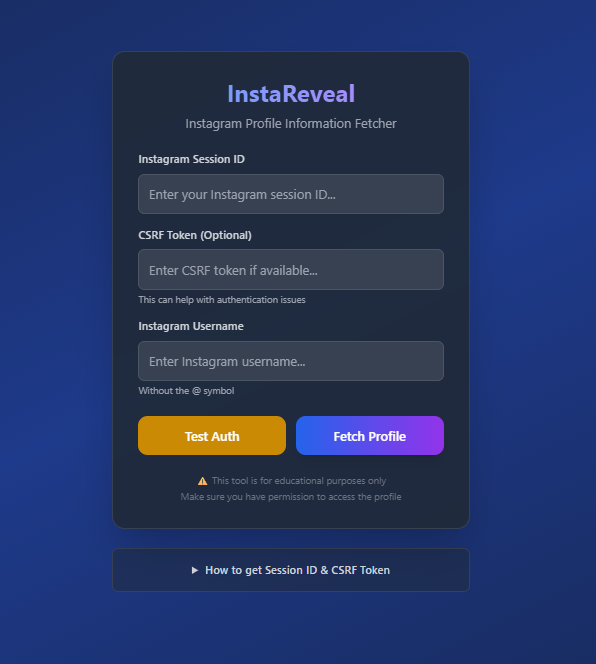
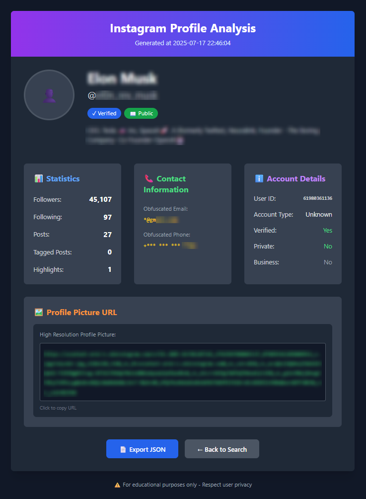

# InstaReveal 🔍

A simple Instagram profile analysis tool that fetches detailed information about Instagram profiles, including some data that's not usually visible in the regular interface.




## What it does

This tool helps you get detailed information about Instagram profiles by using Instagram's internal API. It can fetch things like:

- **Profile Statistics** - followers, following, posts count, etc.
- **Contact Information** - obfuscated email addresses and phone numbers (when available)
- **Account Details** - verification status, account type, business info
- **High-Resolution Profile Pictures** - direct URLs to full-size profile images
- **Export Options** - save all data as JSON for further analysis

## How to use

1. **Get your Instagram session data**
   - Open Instagram in your browser and log in
   - Open Developer Tools (F12)
   - Go to Application tab → Cookies → instagram.com
   - Copy your `sessionid` and `csrftoken` values

2. **Run the tool**
   - Enter your session ID and CSRF token
   - Type the Instagram username you want to analyze
   - Click "Fetch Profile"

3. **View the results**
   - The tool will display all available information
   - You can export the data as JSON if needed

## Features

- Clean, modern web interface
- Responsive design that works on mobile and desktop
- Export functionality for data analysis

## Installation

```bash
git clone https://github.com/robertaitch/instareveal.git
cd instareveal
pip install -r requirements.txt
python app.py
```

Then open `http://localhost:5000` in your browser.

## Technical details

Built with Flask and JS. Uses Instagram's web API endpoints to gather profile information. The tool respects Instagram's rate limits and only fetches publicly available data.

## Important notes

⚠️ **This tool is for educational purposes only**

* Make sure you have permission to analyze the profiles you're looking up
* Don't use this for spam, harassment, or any malicious activities
* Respect people's privacy and Instagram's terms of service
* The obfuscated contact info is already partially hidden by Instagram for privacy

## Why I built this

I was curious about what kind of information Instagram’s API actually returns about user profiles, so I decided to build a clean interface to explore and visualize this data. It's fascinating to discover details that aren't available through the standard Instagram interface—such as obfuscated contact information like phone numbers and email addresses. In the context of OSINT investigations, uncovering this hidden layer can often provide the final piece of the puzzle and help establish connections or verify identities that would otherwise remain out of reach.

## Disclaimer

This project is not affiliated with Instagram or Meta. It's an independent tool that uses publicly available API endpoints. Use responsibly and respect others' privacy.

## Contributing

Feel free to open issues or submit pull requests if you find bugs or want to add features. Just keep in mind this should remain educational and ethical.

---

Made with ❤️ for learning purposes